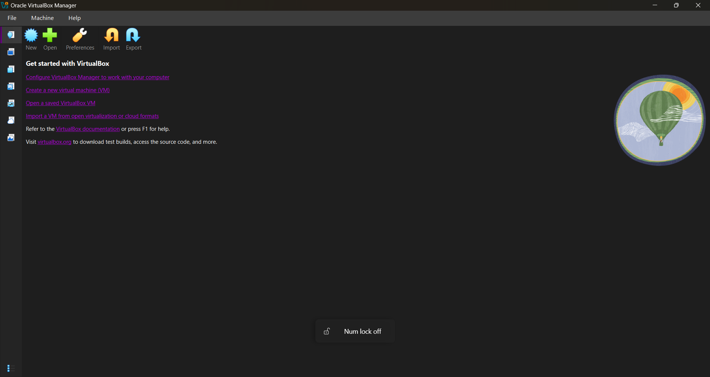
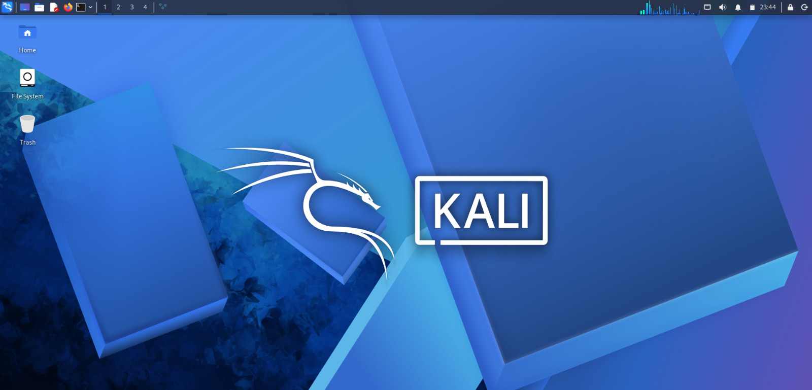
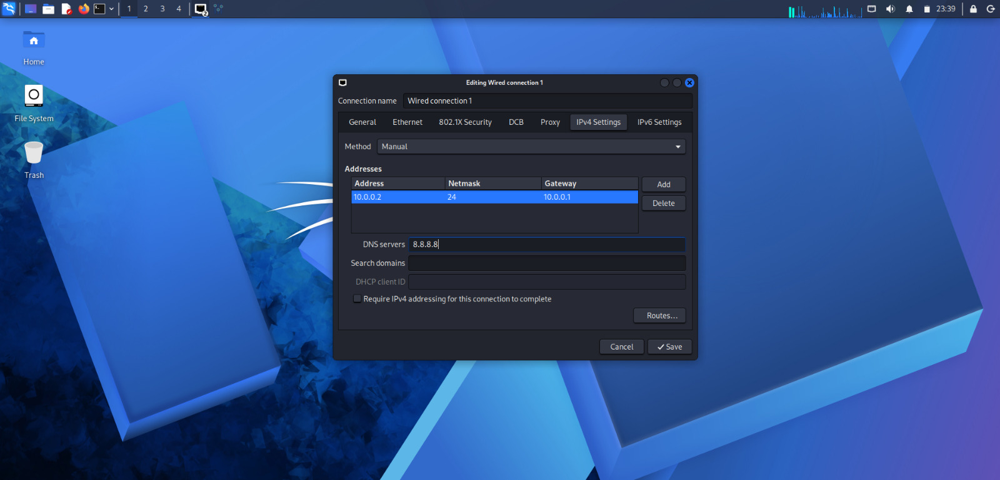

# NETWORKWALKS-B083-WK1-PM1-CYBERSECURITY-LAB-SETUP

## Cybersecurity Internship – Week 1

This repository contains my Week 1 Cybersecurity Lab Setup completed as part of my Networkwalks cybersecurity internship.

The main objective of this task was to build a basic cybersecurity lab using Oracle VirtualBox and Kali Linux, configure the virtual network, and verify that the environment was ready for upcoming cybersecurity practical sessions.

---

## My System Details

| Component | Details |
|---|---|
| Operating System | Windows 11 Home |
| Processor | 13th Gen Intel(R) Core(TM) i5-13420H |
| RAM | 16 GB |
| Storage | 477 GB |
| Graphics | 4 GB |

---

## Virtual Lab Configuration

| Component | Configuration |
|---|---|
| Virtualization Software | Oracle VirtualBox 7.2.6 |
| Operating System | Kali Linux 2026.2 |
| VM RAM | 2048 MB (2 GB) |
| Network Type | NAT Network |
| Network Name | `NatNetwork` |
| Network Range | `10.0.0.0/24` |
| Snapshot | Created |

---

# Lab Setup

## 1. VirtualBox Setup

I started by creating the cybersecurity lab environment using Oracle VirtualBox.

A Kali Linux virtual machine was created and configured with the required system resources. The VM was allocated 2 GB of RAM and connected to the configured NAT Network.

### Screenshot



[🔗 View VirtualBox Screenshot](Screenshot-1-Virtualbox.png)

---

## 2. NAT Network Configuration

A NAT Network was configured in VirtualBox for the virtual cybersecurity lab environment.

The network configuration used was:

```text
Network Name  : NatNetwork
Network Range : 10.0.0.0/24
```

This network will be used for the cybersecurity practical exercises in the upcoming sessions.

### Screenshot


[🔗 View Network Configuration Screenshot](Screenshot-2-network-settings.png)

---

## 3. Kali Linux Setup

Kali Linux 2026.2 was installed and configured as the main operating system for the cybersecurity lab.

After starting the virtual machine, I verified the basic system configuration before proceeding with the network configuration.

### Screenshot



[🔗 View Kali Linux Screenshot](Screenshot-3-kali-linux.png)

---

## 4. Kali Linux Network Configuration

The Kali Linux virtual machine was connected to the `NatNetwork` configured in VirtualBox.

I checked the network configuration inside Kali Linux to make sure that the VM was connected to the expected virtual network.

### Screenshot



[🔗 View Kali Network Configuration Screenshot](Screenshot-4-kali-network-settings.png)

---

# Troubleshooting

During the lab setup, I checked the network configuration in both VirtualBox and Kali Linux.

The main checks included:

- Confirming that the correct NAT Network was selected.
- Checking the configured network range.
- Verifying that Kali Linux was connected to the configured network.
- Checking the network settings inside Kali Linux.
- Creating a VM snapshot after completing the setup.

After verifying the configuration, the virtual cybersecurity lab was ready for the next practical exercises.

---

# What I Learned

From this practical, I learned:

- How to create and configure a virtual machine using VirtualBox.
- How to configure Kali Linux for cybersecurity practice.
- How to create and configure a NAT Network.
- How to connect a virtual machine to a custom network.
- How to check network settings inside Kali Linux.
- How to troubleshoot basic virtual networking issues.
- How VM snapshots can be useful before starting new practical exercises.

---

# Outcome

The Week 1 cybersecurity lab environment was successfully prepared.

| Task | Status |
|---|---|
| VirtualBox Setup | ✅ Completed |
| Kali Linux Setup | ✅ Completed |
| NAT Network Configuration | ✅ Completed |
| Kali Network Verification | ✅ Completed |
| VM Snapshot | ✅ Completed |

The environment is now ready for the upcoming cybersecurity labs and practical exercises.

---

# Disclaimer

This repository is created for educational and cybersecurity training purposes.

All testing and configuration were performed within my own virtual lab environment.

Cybersecurity tools and techniques should only be used on systems and networks for which you have proper authorization.

---

# Author

**Indhumathi V**

**Networkwalks Cybersecurity Internship**

---

## Week 1 Completed

**Cybersecurity Lab Setup — Completed **
